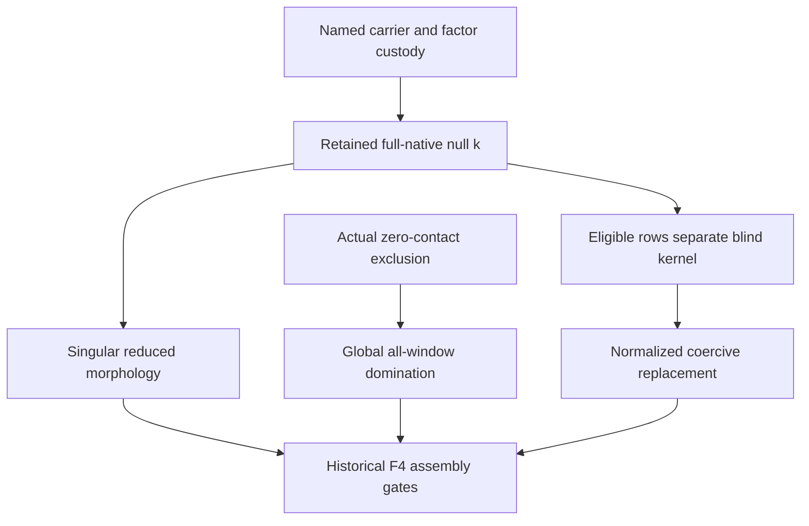

# RPB108: exact normalization gate for changing the actual selection

Date: 2026-10-06 (America/Los_Angeles). Live source c2fa3f9adf0eb6cf954e99d831d9a6376ed161a8.
Definitions: [normalization-compatible selection transport](../docs/TERMINOLOGY_RPB108_NORMALIZATION_COMPATIBLE_SELECTION.md).
Global/F4 lane; certified whole-domain frontier 19/20 is reused, not recomputed.

## Result

For arbitrary coercive actual finite selections, the finite null coefficients have a canonical invertible transport preserving the same physical full-null vector. The transport need not be isometric. Unit gain fixes the packet's total norm, so no choice of compensator or positive padding can hide a change in selected sample energy.

For a blind prescribed selection, a finite disjoint augmentation preserving its normalized retained physical vector exists **if and only if** actual unselected source blocks vanishing on that vector separate the blind kernel. This reduces the normalization-preserving repair question to a specific restricted-observation theorem, stronger than complete negative-source injection. The actual restricted-observation theorem is not proved here.

## Arbitrary selections: physical transport versus metric transport

At a nonnegative actual window let A be the native operator and K=ker A. For two actual selections R_j with coercive G_j=A+R_j*R_j, write
D_j=I-R_j G_j^(-1) R_j*.
The previously established exact reconstruction gives mutually inverse maps
E_j:K->ker D_j, E_j h=-R_j h,
and F_j:ker D_j->K, F_j u=-G_j^(-1)R_j*u.
Consequently
\[
J_{21}=E_2 F_1=R_2G_1^{-1}R_1^*:\ker D_1\longrightarrow\ker D_2,
\qquad J_{12}J_{21}=I_{\ker D_1}.
\tag{1}
\]
The restriction to ker D_1 is essential; the ambient matrix need not be invertible. For a third coercive selection, J_32 J_21=J_31 on ker D_1. In every case F_2 J_21 u=F_1 u: the physical vector is unchanged.

For h,g in K,
\[
\langle J_{21}E_1h,J_{21}E_1g\rangle=\langle R_2h,R_2g\rangle.
\tag{2}
\]
Thus J_21 is unitary between these finite defect kernels exactly when the two selected metrics agree on K. For a single retained k, norm preservation is exactly ||R_2 k||=||R_1 k||. Even this does not identify its prescribed coefficients: for a prescribed carrier embedding V one additionally needs R_2 k=V R_1 k, with the actual weights/sign conventions. Equality of one norm alone proves no named row or covariance identity.

A fresh root packet on this same k has u_j=-R_j k, a_j=G_j^(1/2)k, and ||a_j||=||u_j||. More generally **any** attached packet a=Cu=P*k with C*C u=u has ||a||^2=||u||^2. Its total coefficient norm is therefore 2||R_j k||^2. Positive coefficient padding cannot change this number while preserving the attained unit-gain/adjoint equations. Restoring a prescribed normalization after a metric change scales k, changing the physical vector. This is distinct from dilation, which also changes support and the physical function.

## Exact finite repair criterion for a blind prescribed selection

Now the prescribed R may miss N=K intersect ker R. Keep a fixed nonzero attached retained k in K, with Rk nonzero. Let allowed disjoint additions consist of actual unselected coordinate blocks, with required partner closure included. Define Z_k using precisely those blocks all of whose weighted samples on k vanish. As a restriction of the complete bounded negative analysis, Z_k is bounded.

The following conditions are equivalent:
1. There is a finite union T of allowed disjoint source blocks with Tk=0 and Rplus=(R,T) separating all K.
2. N intersect ker Z_k={0}.

The forward implication is immediate: every row of T is eligible, and separation on K implies separation on N.

For the reverse implication, the finite-dimensional unit sphere of N is compact. For each n on that sphere, restricted injection supplies an eligible coordinate block detecting n; the nonvanishing condition persists on a neighborhood. A finite subcover supplies finitely many eligible blocks T detecting every nonzero n in N. All their rows vanish on k. If Rh=Th=0 for h in K then h belongs to N and hence h=0. Thus Rplus separates K and its effective covariance is coercive by the existing positive Fredholm argument. If N={0}, the empty augmentation suffices.

For any disjoint augmentation,
\[
\|Rplus\,k\|^2=\|Rk\|^2+\|Tk\|^2.
\tag{3}
\]
Hence Tk=0 is also **necessary** for preserving the retained total coefficient norm on the same physical k. This proves the criterion is exact for normalized disjoint repair, not just sufficient. The old positive synthesis can be replaced by the fresh coercive root while retaining k and its attained coefficient norms; an isometry of the single positive witness line is available. A unitary identification of entire positive carriers, the historical filtration and named arithmetic fields is not supplied.

If a complete negative-source injection is the only input, the criterion does not follow: it permits detecting rows that do not vanish on k. In the existing control A=0, P0=N0=I on C^2, R(x,y)=x and k=(1,1), N=span(e2) and no unselected row is eligible. Ordinary finite repair exists; normalized same-vector repair does not. Conversely for k=(1,0), the unselected y row is eligible and separates N. Both controls obey the complete source identity; neither is an actual-zeta contact.

The criterion allows whole required partner blocks only. Arbitrary linear combinations or reweighting are not certified coordinate additions with the original source metric. An isometry of a carrier cannot change the squared norm in (3).

## Minimal remaining obligations and dependency graph

| Gate | Exact remaining statement | Category |
| --- | --- | --- |
| Named attachment | Actual same-domain carrier/row/covariance identities for the retained P,C,k | Retained attachment |
| Normalized disjoint coercive repair, if demanded | N intersect ker Z_k={0} | Retained attachment; unnecessary for the existing singular reduced morphology |
| Arbitrary selection substitution on one vector | Equal selected energy, plus prescribed coefficient map/custody if identity is demanded | Retained attachment |
| Actual zero-eigenvalue contact exclusion | Use the actual zero-normalized null equation to exclude nonzero K | Endpoint exclusion |
| Enlarged same-vector null equation | Full-native enlarged residual vanishes for the unchanged physical k | Null transport; existing translation rigidity obstructs this for nonzero full-null k |

The arrows into F4 gates do not assert sufficiency: historical support/central-cancellation and exact coefficient custody must still be audited. In particular the optional normalized repair route is not mandatory when the singular synthesis morphology already suffices. Coefficient transport (1) occurs at one physical support; it supplies no enlarged full-native mixed cancellation and no first-contact exclusion. Same-vector enlargement cannot be inferred from an isomorphism of finite defect kernels.

## Validation and custody

Pinned source blobs and repeated exact rational controls are in notes/data/RPB108_NORMALIZATION_COMPATIBLE_SELECTION_20261006.json. Controls check inverse reconstruction, transport composition, metric mismatch, total coefficient norm, and the eligible-block criterion in both passing and obstructed finite source systems. These are algebra controls, not actual divisor samples. No Lean changes, compiler result, new axiom audit or actual historical instance is claimed. All historical certificates and wording are preserved. F4 and FULL TRANSPORT CLOSED remain open.
